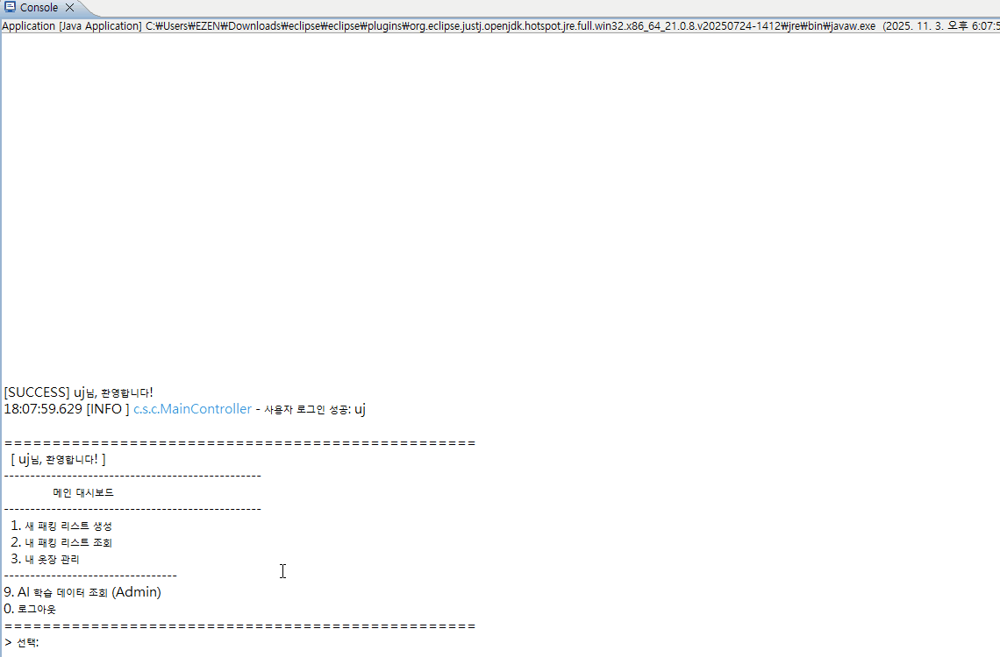
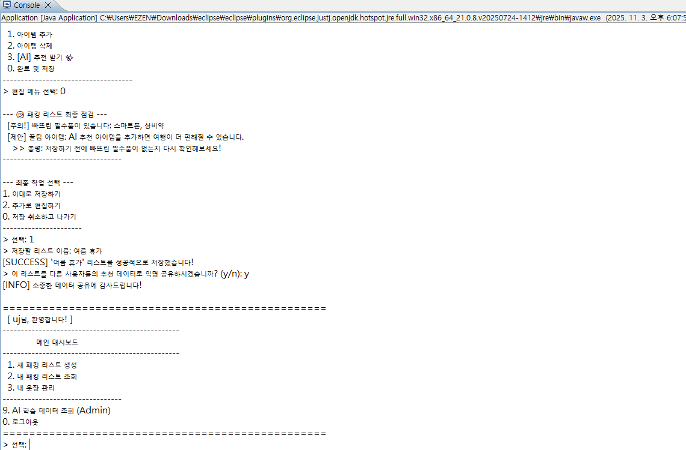
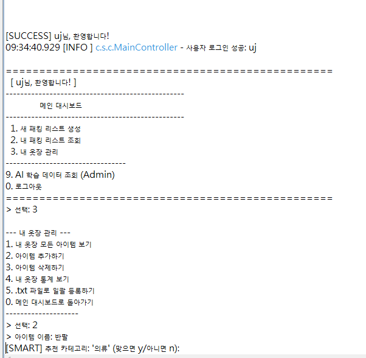
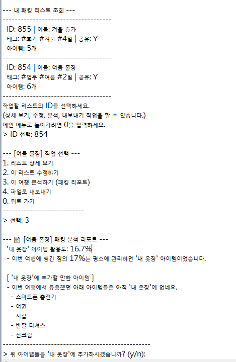
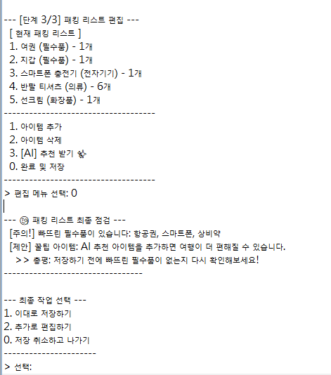
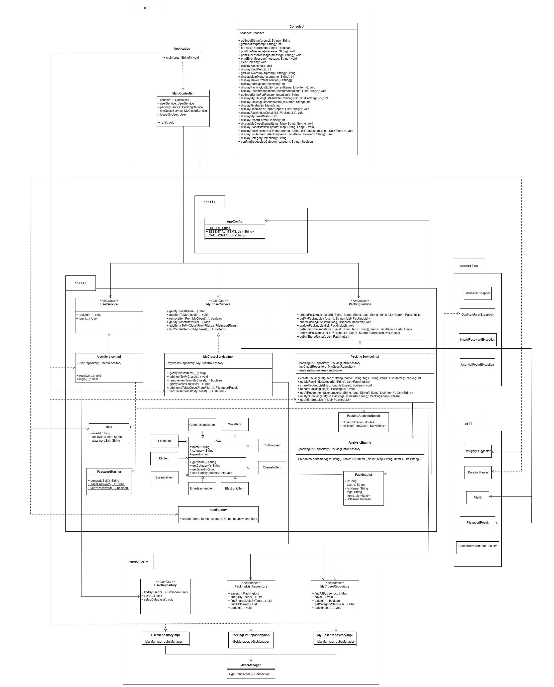

# Smart Packer CLI: 데이터 기반 지능형 짐 싸기 추천 엔진

Smart Packer CLI는 단순한 체크리스트가 아닌, '집단 지성(공유 데이터)'과 '개인화(내 옷장)'를 통해 최적의 짐 싸기 목록을 제안하는 **순수 Java 기반 지능형 추천 엔진**입니다.

## 0. 프로젝트 목표 (Project Goal)

단순히 짐을 체크하는 To-Do 리스트가 아니라, "내가 뭘 빠뜨렸지?"라는 근본적인 문제를 데이터로 해결하고 싶었습니다.

이를 위해 '집단 지성(공유 데이터)'과 '개인화(내 옷장)'라는 두 가지 데이터를 활용하여, 사용자가 미처 생각하지 못한 아이템까지 제안하는 **지능형 추천 엔진**을 순수 Java 환경에서 구현하는 것을 목표로 했습니다.

## 1. 주요 기능 (Features)

* **🧠 지능형 추천 엔진**: 여행 프로필(계절, 목적)을 입력하면, 공유된 다른 여행자들의 데이터를 분석하여 '경험자들의 꿀팁 아이템'을 제안합니다.
* **👕 스마트 템플릿**: '여름 휴가'에는 '수영복'을, '겨울 출장'에는 '노트북'을 제안하고 여행 기간에 맞춰 의류 수량까지 조절된 맞춤형 템플릿을 제공합니다.
* **💡 '내 옷장' 연동**: "셔츠" 추가 시, '내 옷장'에 등록된 "파란색 린넨 셔츠"를 먼저 제안하여 개인화된 패킹을 돕습니다.
* **📊 패킹 분석 리포트**: '내 옷장' 활용도, 미보유 아이템 구매 제안 등 데이터 기반의 실용적인 인사이트를 제공합니다.
* **🤖 스마트 카테고리 추천**: "노트북" 입력 시 "전자기기" 카테고리를 자동 제안하여 입력을 돕습니다.
* **🧐 최종 점검 리포트**: 짐 싸기 완료 직전, AI가 추천했으나 빠뜨린 아이템이 없는지 마지막으로 점검합니다.

---

(GIF 썸네일을 클릭하시면 원본 크기의 애니메이션으로 보실 수 있습니다 🔎)

| GIF 1: 보안 로그인 | GIF 2: AI 핵심 기능 | GIF 3: AI 데이터 조회 (Admin) |
| :---: | :---: | :---: |
|  |  |  |
| `System.console()`을 활용한 비밀번호 마스킹 및 보안 인증. (IDE 환경에서는 경고 메시지와 함께 비밀번호가 노출되며, 이는 의도된 대체 동작입니다.) | '스마트 템플릿'과 'AI 꿀팁 추천'의 핵심 로직 | `is_shared=true`로 설정된 AI 학습 데이터셋 조회 기능 |

---

<b>📸 추가 기능 스크린샷 (클릭해서 펼쳐보기)</b>

 

| 스마트 카테고리 추천 | 패킹 분석 리포트 |
| :---: | :---: |
| `[SMART]` 추천 카테고리 제안 (y/n) | '내 옷장' 활용도(%) 및 아이템 제안 |
|  |  |
| **최종 점검 리포트** | **내 옷장 통계 (시각화)** |
| `[CHECK]` 저장 직전, 빠뜨린 AI 추천 점검 | ASCII 막대 그래프로 표현된 통계 |
|  |  |

## 3. 기술 스택 (Tech Stack)

* **Language**: `Java`
* **Environment**: `Pure Java` (No Frameworks)
* **Database**: `SQLite`, `JDBC`
* **Libraries**:
    * `Gson`: 객체 다형성 유지를 위한 데이터 직렬화/역직렬화
    * `JUnit 5`: 단위 및 통합 테스트
    * `SLF4J` & `Logback`: 실무 표준 로깅 시스템

---

## 4. 아키텍처 및 핵심 설계

이 프로젝트는 프레임워크 없이 3계층 아키텍처와 DIP(의존성 역전 원칙)를 기반으로, 각 객체의 책임과 관계를 명확히 분리하여 설계되었습니다.

  

프레임워크의 도움 없이, **'왜'** 그렇게 설계해야 하는지에 대한 고민을 바탕으로 구축되었습니다.

### 1. 3계층 아키텍처 및 수동 DI
* `cli(표현)` - `domain(비즈니스)` - `repository(데이터)` 3계층으로 책임을 명확히 분리했습니다.
* `Application` 클래스가 모든 객체(Service, Repository)를 직접 생성하고 <b>생성자를 통해 주입(Manual DI)</b>하는 방식을 채택했습니다. 이는 스프링과 같은 프레임워크가 왜 <b>DI(의존성 주입)</b>와 <b>IoC(제어의 역전)</b>를 사용하는지 그 원리를 이해하고 적용한 결과입니다.

### 2. SOLID 원칙: 의존성 역전 원칙 (DIP)
* `Domain` 계층(e.g., `UserService`)이 `UserRepositoryImpl`이라는 <b>'구현체'</b>에 직접 의존하지 않고, `UserRepository`라는 <b>'인터페이스(Interface)'</b>에만 의존하도록 설계했습니다.
* 이 설계 덕분에, **메인 코드**에서는 `JDBC` 구현체를 주입하고, **테스트 코드**에서는 `UserService` 코드 수정 없이 `인메모리 DB`용 구현체를 주입하여 **테스트 환경을 완벽하게 격리**할 수 있었습니다.

### 3. 유지보수성을 위한 클린 코드
* **`AppConfig` (설정 중앙화):** `DB_URL`, `MAX_AI_RECOMMENDATIONS` 등 바뀔 수 있는 값들을 `AppConfig`에서 중앙 관리하여 **'매직 넘버'**를 제거하고, 향후 설정 변경이 필요할 때 단 한 곳만 수정하면 되도록 설계했습니다.
* **`logback.xml` (설정 외부화):** 로깅의 형식과 레벨을 Java 코드가 아닌 `logback.xml`에서 관리하도록 분리하여, 코드 재컴파일 없이 로깅 정책을 변경할 수 있습니다.

---

## 5. 핵심 문제 해결 과정 (기술적 깊이)

프로젝트의 기술적 깊이를 증명하는 5가지 핵심 해결 과제입니다.

### 1. [OOP] 객체 다형성과 JSON 역직렬화 문제
* **문제:** '의류', '전자기기' 등은 서로 다른 속성을 가집니다. 이를 `Item` 추상 클래스와 `ClothingItem` 등 서브클래스로 **객체지향적 다형성**을 구현했으나, `Gson`이 DB의 JSON을 `abstract class`로 복원하지 못하는 `JsonParseException`이 발생했습니다.
* **해결:**
    * 객체지향 설계를 포기하는 대신, <b>`ItemFactory`(팩토리 패턴)</b>와 `RuntimeTypeAdapterFactory`를 도입했습니다.
    * JSON 내부의 `category` 값을 읽어 `ClothingItem`인지 `ElectronicItem`인지 동적으로 판단하여, **DB에 저장된 JSON에서 객체의 다형성을 완벽하게 복원**해냈습니다.

### 2. [Test] 테스트 격리 및 신뢰성 확보
* **문제:** `UserRepository` 테스트 코드가 실제 DB(`smart_packer.db`)를 건드리면, 테스트 순서나 기존 데이터에 따라 결과가 달라지는 '신뢰할 수 없는 테스트'가 됩니다.
* **해결:**
    * 테스트 실행 시마다 메모리에서 생성되고 종료 시 깨끗하게 사라지는 <b>`인메모리 DB(jdbc:sqlite::memory:)`</b>를 사용하도록 테스트 환경을 **완벽히 격리**했습니다.
    * 이는 "테스트는 몇 번을 돌려도 항상 같은 결과가 나와야 한다"는 테스트의 멱등성을 보장하며, 향후 리팩토링 시 코드가 망가지는 '퇴보(Regression)'를 막아주는 강력한 안전망이 됩니다.

### 3. [Security] 안전한 사용자 인증 설계
* **문제:** 비밀번호를 평문이나 단순 해시로 저장 시 보안에 취약합니다.
* **해결:**
    1.  **Salt & Hashing:** 사용자별 고유 `Salt`를 생성하여 `SHA-26` 해싱을 적용, 레인보우 테이블 공격을 방지했습니다.
    2.  **Masking:** `System.console()`을 활용, 터미널 환경에서 비밀번호 입력 시 마스킹(`*`) 처리하여 정보 노출을 방지했습니다.

### 4. [Exception] 사용자 중심의 예외 처리 전략
* **문제:** `SQLException`이나 `DuplicateUserException` 같은 기술적 예외가 사용자에게 그대로 노출되면 UX를 해치고, 시스템의 내부 로직이 노출됩니다.
* **해결:**
    1.  **커스텀 예외:** `DuplicateUserException`, `InvalidPasswordException` 등 비즈니스 상황에 맞는 커스텀 예외를 정의했습니다.
    2.  **예외 래핑(Wrapping):** `Repository` 계층의 `SQLException`을 `DatabaseException`(Runtime)으로 감싸, 상위 계층이 `JDBC` 기술에 종속되지 않도록 분리했습니다.
    3.  **예외 번역(Translation):** `MainController`가 모든 예외를 최종적으로 `catch`하여, "이미 존재하는 아이디입니다."와 같이 **사용자가 이해할 수 있는 명확한 언어로 '번역'**하여 안내하도록 설계했습니다.

### 5. [DB] 데이터 무결성 보장
* **문제:** 만약 회원이 탈퇴(`DELETE`)할 때, 이 회원이 작성한 `packing_lists`나 `my_closet` 데이터가 삭제되지 않고 남아있다면 '고아 데이터(Orphan Data)'가 되어 DB를 오염시킵니다.
* **해결:**
    * DB 스키마 설계 시 `FOREIGN KEY` 제약조건과 함께 **`ON DELETE CASCADE`** 옵션을 적용했습니다.
    * 이를 통해 Java 코드의 실수와 관계없이, `users` 테이블의 부모 데이터가 삭제되면 **DB 레벨에서** 연관된 자식 데이터(짐 목록, 옷장)가 자동으로 함께 삭제되어 **데이터의 무결성**을 100% 보장합니다.

---

## 6. 실행 방법 (How to Run)

1.  `git clone [저장소 URL]`
2.  이클립스(Eclipse)에서 `Import` -> `Existing Projects into Workspace`로 프로젝트를 가져옵니다.
3.  프로젝트의 `.jar` 라이브러리(e.g., `sqlite-jdbc.jar`, `gson.jar` 등)를 Build Path에 추가합니다.
4.  `com.smartpacker.Application.java` 파일의 `main` 메소드를 실행합니다.
5.  (프로그램 최초 실행 시, `seedSharedLists()`가 AI 추천을 위한 더미 데이터를 자동으로 DB에 생성합니다.)
